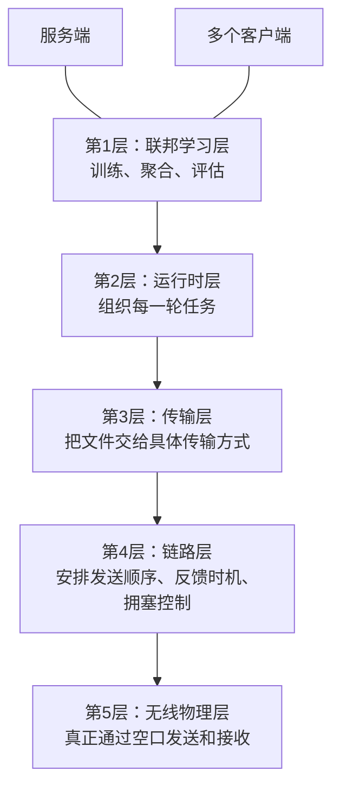

# 项目简要架构说明

本文档基于 [联邦学习系统设计入口](./docs/联邦学习系统设计入口.md) 整理，重点说明系统为什么这样分层、每一层承担什么工作，以及整体是如何协同运行的。

## 一句话概括

这个项目要解决的问题可以简单理解为：

**让联邦学习上层只专心做训练和聚合，底层负责把模型和训练结果稳定地通过无线链路传出去。**

## 整体架构图

## 为什么要分成五层

这样分层，核心是为了把“做联邦学习”和“做无线传输”这两件事拆开。

- 对算法层来说，它只需要关心这一轮该不该发模型、收没收齐结果、什么时候做聚合，不需要理解无线链路细节。
- 对通信层来说，它只需要想办法把数据可靠地发出去，不需要理解训练算法本身。
- 对整个系统来说，这样分层以后，后续如果要优化某一部分，比如改传输方式、改调度策略，通常不用把上层业务全部重写。

换句话说，这五层不是为了“看起来复杂”，而是为了让不同问题在不同层处理，避免所有逻辑混在一起。

## 各层职责说明

### 第1层：联邦学习层

这一层最贴近项目的核心目标，也就是联邦学习本身。

它主要负责：

- 决定每一轮要下发什么模型
- 在客户端完成本地训练后，接收各个客户端上传的更新结果
- 对多个客户端的结果做聚合
- 按照训练计划进入下一轮

这一层可以理解为“业务决策层”。

它关心的是：

- 这一轮训练开始了吗
- 模型发出去了吗
- 客户端结果收齐了吗
- 能不能开始聚合

它**不直接处理**下面这些问题：

- 无线链路是否稳定
- 哪个客户端什么时候可以发
- 数据是通过什么具体协议传的

这样做的好处是，联邦学习算法可以保持清晰，不会被底层通信细节打乱。

### 第2层：运行时层

如果说联邦学习层负责“做什么”，那运行时层负责“按什么顺序做”。

它主要负责把一轮联邦学习组织起来，形成一个完整流程：

1. 服务端发布本轮模型
2. 客户端等待并接收模型
3. 客户端在本地完成训练
4. 客户端提交本轮更新
5. 服务端收集完成后交给上层聚合

这一层可以理解为“流程调度层”。

它的作用是把上层的训练语义，变成一个可以执行的轮次流程。  
它不直接关心无线设备怎么发包，但它知道：

- 什么时候应该开始下发
- 什么时候应该等待客户端返回
- 什么时候说明本轮收集结束

所以，这一层相当于联邦学习层和底层传输层之间的组织者。

### 第3层：传输层

这一层负责把上层的“模型文件交换需求”，变成可执行的“传输动作”。

它主要做两件事：

- 下行时，把服务端的模型文件发给多个客户端
- 上行时，把每个客户端的训练结果传回服务端

从项目设计上看，这一层是一个“适配层”。

它的意义在于：

- 上层只需要说“我要发模型”或“我要收更新”
- 这一层再决定交给哪种具体传输方式去做

这样设计以后，传输方式就可以相对独立演进。  
比如，下行和上行可以采用不同方式，因为它们面对的问题不一样：

- 下行是“一份模型发给多个客户端”
- 上行是“多个客户端分别把自己的结果传回来”

所以这一层的重点不是训练，也不是抢占空口，而是把“数据交换需求”准确地翻译成“传输任务”。

### 第4层：链路层

这一层是整个系统里最关键的一层，也是最能体现项目特点的一层。

因为无线空口不是谁想发就能一直发，尤其在多客户端场景下，如果没有统一安排，就容易出现冲突、拥塞、等待混乱等问题。  
所以这一层专门负责管理“无线链路怎么有序工作”。

它主要负责：

- 决定当前由谁发送
- 控制什么时候留出反馈机会
- 在链路繁忙时做限流和反压
- 连接上层的 IP 数据和下层的无线发送

这一层可以理解为“交通指挥层”。

更直白地说，它像一个现场调度员：

- 让服务端先发模型
- 在合适的时候让客户端反馈有没有缺失
- 客户端训练完以后，不是一起抢着上传，而是按顺序获得发送机会
- 当链路已经很忙时，先让上层慢一点，避免数据越堆越多

为什么这一层必须单独拿出来？

- 因为“发什么”是上层的问题
- “怎么在无线环境里有秩序地发”是链路层的问题

如果把这部分逻辑塞到业务层里，上层代码会非常复杂，而且后续很难维护。

### 第5层：无线物理层

这一层最靠近真实硬件，负责把数据真正送到无线空口中。

它主要负责：

- 无线发送
- 无线接收
- 与底层网卡、射频链路等实际能力对应

这一层可以理解为“真正动手传输的一层”。

前面几层更多是在决定：

- 发什么
- 什么时候发
- 谁先发

而这一层负责把这些决定落实成实际的无线收发动作。

所以它虽然不直接参与训练逻辑，也不负责高层流程控制，但它是整个数据链路最终落地的基础。

## 各层之间怎么配合

从上往下看，整个系统的协作关系可以概括为：

- 联邦学习层提出训练任务
- 运行时层把任务组织成一轮一轮的流程
- 传输层把流程里的文件交换需求交给具体传输方式
- 链路层负责在无线环境里把这些传输动作安排得有秩序
- 物理层最终完成真实的无线发送与接收

也就是说：

- 上层决定“目标”
- 中层负责“组织”
- 下层负责“执行”

## 概括来说就是

可以把这个系统理解成一个“五层流水线”：

- 最上面决定训练任务
- 中间负责组织每一轮的数据交换
- 再往下负责具体怎么传
- 靠近底层的地方负责解决无线环境下谁先发、何时反馈、堵了怎么办
- 最底层负责真实的无线收发

这种分层方式的最大价值，是把复杂问题拆开处理。  
这样既能保证联邦学习逻辑清晰，又能针对无线链路单独做优化，比较适合后续继续扩展和迭代。
